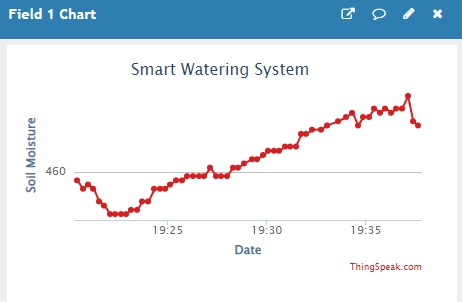

# Smart_Watering_System
Suppose you are going out of home for many days and you are worried about plants dying or wilting until you return. In this project I have given a solution to this. Smart watering system will ensure that the moisture in soil is always sufficient. The following things have been used in the project-

(1) NodeMCU with a stable internet connection.
(2)Soil moisture sensor.
(3)Servo motor.
(4)Power bank.
(5)Jumper wires.
(6)Account in ThingSpeak.

When moisture in soil decreases below a certain value the nodeMCU detects it by getting information from moisture semsor.
It in turn orders the servo motor to sweep which is connected to water jug.It remains in the position until the moisture again increases to a threshold value.
After the threshold value is reached the motor comes to it's normal position and water stops to fall.
Also the nodeMCU is connected to internet so it sends the real time data to ThingSpeak IOT platform which you can see from any part of the world.
So by watching the moisture content you can remain assured that everything is going fine.

Designed System:

  
<\p>

Screenshot from ThingSpeak:

  
<\p>

